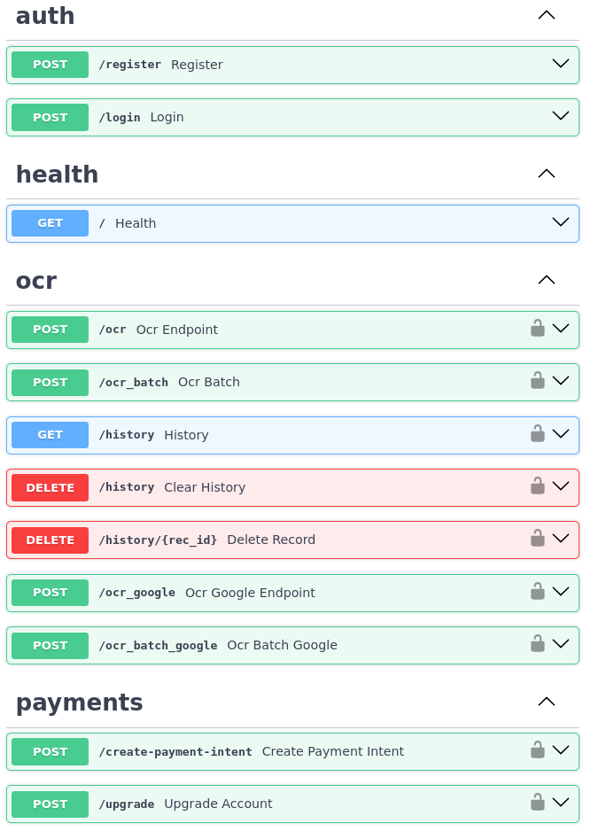

# OCR API 

Una API REST para reconocimiento de texto (OCR) sobre imágenes, con:
- **Capa de datos**: modelos y helpers basados en SQLModel/SQLite (o la base de datos que prefieras).
- **Capa de negocio**: motor de OCR local con EasyOCR + YOLO, y opcional Google Vision para usuarios premium.
- **Capa de presentación**: FastAPI con autenticación JWT y pagos Stripe para la suscripción.

Un servicio REST en **FastAPI** que ofrece:

- Registro, login y autenticación vía JWT.
- OCR local (EasyOCR + detección de tablas con YOLO).
- OCR con Google Vision para usuarios premium.
- Almacenamiento histórico de resultados OCR.
- Suscripción premium y gestión de pagos con Stripe.
- CORS habilitado y configuración por variables de entorno.

---

## Requisitos

- Python 3.10+  
- `pip install -r requirements.txt`


La base de datos y tablas se crean automáticamente al iniciar la app:

```bash
uvicorn main:app --reload
```


## Endpoints principales

> Incluimos un diagrama de los endpoints:

<p align="center">
  
</p>
